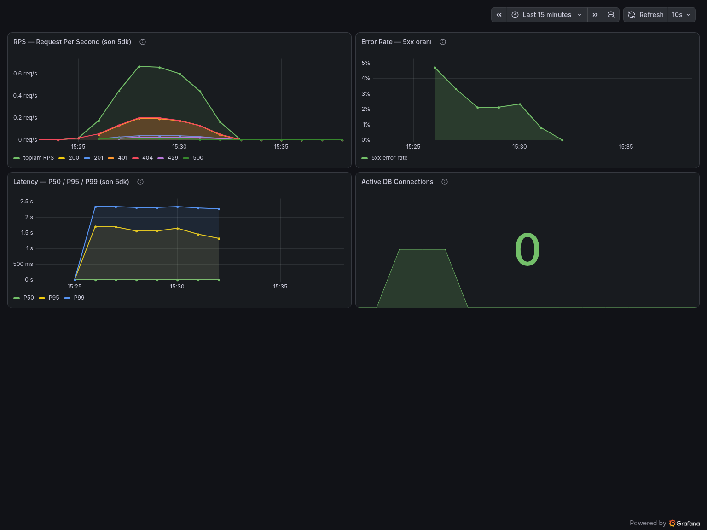

# HTTP Lab


Express 5 + Prisma 7 (PostgreSQL) ile yazılmış, JWT tabanlı kimlik doğrulama
ve rol bazlı yetkilendirme (RBAC) içeren bir REST API projesi. Proje,
kategori bazlı ürünler (`Item`) üzerinde CRUD işlemleri sunar.

> **Week 4 güncellemesi**: Bu sürümde proje SOLID prensipleri ışığında
> refactor edildi ve kapsamlı bir test paketi (unit + integration) eklendi.
> Refactor sürecinin BEFORE/AFTER örnekleri için `REFACTORING_DIARY.md`
> dosyasına bakın.

## Özellikler

- **Kimlik doğrulama**: Kayıt ol / giriş yap, `bcrypt` ile şifre hashleme, `jsonwebtoken` ile access & refresh token üretimi
- **Cookie tabanlı oturum (Week 9)**: Refresh token httpOnly cookie'de + **token rotation** + sunucu tarafı invalidation (`/refresh`, `/logout`)
- **Rol bazlı yetkilendirme (RBAC)**: `ADMIN`, `EDITOR`, `VIEWER` rolleri
- **Sahiplik kontrolü**: Kullanıcılar (ADMIN hariç) yalnızca kendi oluşturdukları ürünleri silebilir
- **Prisma 7 + `@prisma/adapter-pg`**: PostgreSQL ile driver adapter üzerinden, uygulama genelinde **tek bir paylaşılan** bağlantı
- **Merkezi hata yönetimi** ve **request logging** middleware'leri
- **Login rate limiting**: `express-rate-limit` ile 15 dakikada IP başına 5 deneme sınırı (test ortamında devre dışı)
- **Observability (Week 8)**: `pino` ile structured (JSON) logging + her isteğe `requestId` (correlation ID); `prom-client` ile Prometheus metrikleri (`/metrics`) — istek sayısı/süresi (P50/P95/P99) ve aktif DB bağlantısı
- **React Frontend (Week 9)**: `client/` altında Vite + React + Tailwind v4 — login, korumalı route, rol bazlı UI, in-memory access token + silent refresh (bkz. "Frontend & Full-Stack" bölümü)
- **72 test** (unit + integration), gerçek bir PostgreSQL test veritabanına karşı çalışır
- Postman koleksiyonu (`http-lab.postman_collection.json`) ile hazır istek örnekleri

## Teknoloji Yığını

| Katman | Teknoloji |
|---|---|
| Runtime | Node.js |
| Web Framework | Express ^5.2.1 |
| ORM | Prisma ^7.8.0 (`@prisma/client`, `@prisma/adapter-pg`) |
| Veritabanı | PostgreSQL (`pg`) |
| Kimlik Doğrulama | `jsonwebtoken`, `bcrypt` |
| Test | `jest`, `supertest` |
| Logging | `pino` (+ `pino-pretty` dev'de) |
| Metrics | `prom-client` (Prometheus) |
| Ortam Değişkenleri | `dotenv` |
| Geliştirme | `nodemon` |
| Frontend (Week 9) | Vite + React 19, Tailwind CSS v4, React Router 7, Phosphor Icons |
| Frontend Sunumu | Nginx (docker compose'da statik dosya sunumu) |

---

## SOLID Analizi (Refactor Öncesi Bulgular)

Refactor'a başlamadan önce mevcut koddaki SOLID ihlalleri şu üç soru
üzerinden incelendi. Ayrıntılı BEFORE/AFTER örnekleri için
`REFACTORING_DIARY.md` dosyasına bakın.

### 1. SRP — Tek bir fonksiyonun birden fazla işi var mıydı?

- **`src/routes/auth.js`** (`/login`, `/register` handler'ları): HTTP
  isteğini yönetme, girdi doğrulama, **şifre hashleme kararı** (bcrypt,
  salt rounds = 12), **JWT üretim stratejisi** (payload şekli, `expiresIn`
  süreleri) ve veritabanı erişimini aynı anda taşıyordu.
- **`src/middleware/authMiddleware.js`**: `jwt.verify` çağrısı doğrudan
  middleware gövdesine gömülmüştü; "token nasıl doğrulanır" kuralı
  "Express isteğini nasıl işlerim" sorumluluğuyla iç içeydi.
- **`src/app.js`**: Hem Express uygulamasını inşa ediyor hem de
  `app.listen(...)` ile sunucuyu gerçekten başlatıyordu — "ne" ile "nasıl
  çalıştırılır" sorumlulukları aynı dosyadaydı ve bu, dosyanın test
  amacıyla import edilmesini bile imkansız kılıyordu (import etmek otomatik
  olarak bir port açıyordu).

### 2. OCP — Yeni özellik eklemek için mevcut kodu değiştirmek gerekiyor muydu?

- Token üretim mantığı (`jwt.sign` çağrıları) `auth.js` içine gömülü
  olduğundan, token süresini, algoritmasını veya payload yapısını
  değiştirmek doğrudan route dosyasının düzenlenmesini gerektiriyordu.
- Şifre hashleme stratejisi (salt rounds sabiti) route içinde satır
  içiydi; ileride farklı bir hashing yaklaşımına geçmek yine route
  dosyasına dokunmayı gerektirirdi.
- Login rate limiting kuralı (`max: 5`) hiçbir ortam farkı gözetmeden
  sabitti — bu, testlerde IP başına 5 istekten sonra tüm login
  isteklerinin 429 ile engellenmesine (dolayısıyla testlerin "sessizce"
  403/undefined token almasına) yol açan gerçek bir sorun olarak ortaya
  çıktı.

### 3. DI — Bağımlılıklar sınıf/modül içinde mi oluşturuluyordu?

- **En kritik bulgu**: `src/routes/auth.js` ve `src/store/itemsDb.js`,
  birbirinden tamamen bağımsız İKİ AYRI `Pool` + `PrismaPg` adapter +
  `PrismaClient` üçlüsü oluşturuyordu. Aynı uygulama için iki ayrı
  veritabanı bağlantı havuzu açılıyordu; bu hem kaynak israfıydı hem de
  test sırasında bu bağımlılığı sahte (mock) bir client ile değiştirmeyi
  pratik olarak imkansız kılıyordu.
- `itemsDb.js`, somut `PrismaClient` sınıfına doğrudan bağımlıydı; routes
  katmanı bu modülü import ederken bir soyutlama üzerinden değil,
  doğrudan somut implementasyon üzerinden çalışıyordu.

**Refactor sonrası çözüm özeti**: `src/db/prisma.js` içinde tek bir
paylaşılan Prisma client singleton'ı; `src/utils/tokenService.js` ve
`src/utils/passwordService.js` içinde izole edilmiş, saf ve bağımsız test
edilebilir servisler; `src/app.js` / `src/server.js` ayrımı ile test
edilebilir bir Express uygulaması.

---

## Proje Yapısı (Refactor Sonrası)

```
http-lab/
├── prisma/
│   ├── migrations/
│   ├── schema.prisma
│   └── seed.js
├── src/
│   ├── app.js                    # Express app'i İNŞA EDER, dinlemeye başlamaz (test edilebilir)
│   ├── server.js                 # app.js'i import edip gerçekten dinlemeye başlatan tek yer
│   ├── db/
│   │   └── prisma.js             # Uygulama genelinde TEK paylaşılan Prisma client (DIP)
│   ├── utils/
│   │   ├── tokenService.js       # JWT üretme/doğrulama — saf, bağımsız test edilebilir
│   │   └── passwordService.js    # bcrypt hash/compare — saf, bağımsız test edilebilir
│   ├── middleware/
│   │   ├── authMiddleware.js     # authenticateToken & requireRole (artık tokenService kullanır)
│   │   ├── errorHandler.js
│   │   └── requestLogger.js
│   ├── routes/
│   │   ├── auth.js               # Artık sadece orkestrasyon yapar (SRP)
│   │   └── items.js
│   └── store/
│       └── itemsDb.js            # Paylaşılan prisma client'ı kullanır, create() bug'ı düzeltildi
├── tests/
│   ├── jest.setup.js             # .env.test'i yükler
│   ├── testUtils/resetDb.js      # Her testten önce DB'yi temizler
│   ├── unit/
│   │   ├── tokenService.test.js
│   │   ├── passwordService.test.js
│   │   └── authMiddleware.test.js
│   └── integration/
│       ├── auth.integration.test.js
│       └── items.integration.test.js
├── REFACTORING_DIARY.md
├── http-lab.postman_collection.json
├── prisma.config.ts
├── .env.example
└── package.json
```

## Veri Modeli

- **User**: `email`, `name`, `password` (bcrypt hash), `role` (`ADMIN` / `EDITOR` / `VIEWER`, varsayılan `VIEWER`), `refreshToken`
- **Category**: `name` (unique), birden çok `Item` ile ilişkili
- **Item**: `name`, `price`, `description` (opsiyonel), bir `Category`'e ve opsiyonel olarak onu oluşturan `User`'a bağlı

## Kurulum

### Yöntem A — Docker Compose (önerilen, asıl yöntem)

Bu proje, production'da da (Railway/Render) container olarak çalışacağı için,
yerelde de aynı şekilde `docker compose up` ile çalıştırılması **canonical**
(asıl) yöntem kabul edilir — "kendi bilgisayarımda çalışıyor ama container'da
çalışmıyor" sürprizlerini önler. Neden bu karar verildi, bkz. `LEARNING_LOG.md`.

1. `.env.example` dosyasını `.env` olarak kopyalayın; `DATABASE_URL`'deki host
   kısmını **`db`** olarak bırakın (bu, `docker-compose.yml`'deki servis adıdır,
   `localhost` DEĞİL — container'lar birbirine Docker'ın iç DNS'i üzerinden bu
   isimle ulaşır).
2. ```bash
   docker compose up --build
   ```
   Bu komut `app` (API), `db` (PostgreSQL), `client` (React frontend, Nginx
   ile `http://localhost:5173`) ve `adminer` (DB yönetim arayüzü,
   `http://localhost:8080`) servislerini ayağa kaldırır. `app` container'ı
   açılırken `Dockerfile`'daki `CMD` sayesinde migration'ları otomatik uygular.
3. Sunucu `http://localhost:3000`, frontend `http://localhost:5173` adresinde
   çalışır. Frontend'in API'ye erişebilmesi için `.env`'de
   `FRONTEND_URL=http://localhost:5173` satırının açık olması gerekir
   (bkz. "CORS" bölümü — bu satır kapalıyken CORS bilinçli olarak "kırık"tır).

Kod değiştirdikçe image'ı yeniden build etmeniz gerekir (`docker compose up
--build`); `package*.json` değişmediyse Docker'ın layer cache'i sayesinde
`npm ci` adımı tekrar çalışmaz, sadece kaynak kod kopyalanır — bu yüzden
rebuild beklenenden hızlıdır.

### Yöntem B — Native (`npm run dev`, hızlı iterasyon için)

Sık kod değişikliği yapıp anında yeniden yükleme (hot reload) istiyorsanız,
uygulamayı container dışında, `nodemon` ile native çalıştırabilirsiniz. Bu
durumda Postgres'e host makineden erişmeniz gerektiği için:

1. `.env`'de `DATABASE_URL` host kısmını `localhost` yapın.
2. `docker-compose.yml`'deki `db` servisine **geçici olarak** (commit
   etmeden) şunu ekleyin:
   ```yaml
   ports:
     - "5432:5432"
   ```
3. ```bash
   npm install               # postinstall -> prisma generate
   docker compose up db adminer   # sadece veritabanını container'da çalıştır
   npx prisma migrate deploy      # veya geliştirmede: npx prisma migrate dev
   npx prisma db seed             # (opsiyonel) örnek veri
   npm run dev                    # nodemon ile src/server.js
   ```

Sunucu varsayılan olarak `http://localhost:3000` adresinde çalışır.

## API Uç Noktaları

### Health & Observability
| Metod | Yol | Açıklama | Erişim |
|---|---|---|---|
| GET | `/health` | Servisin ve DB bağlantısının canlılığını kontrol eder (200/503) | Herkes |
| GET | `/metrics` | Prometheus formatında metrikler | Sadece internal (bkz. "Monitoring & Alerting") |

### Auth (`/api/auth`)
| Metod | Yol | Açıklama | Not |
|---|---|---|---|
| POST | `/register` | Yeni kullanıcı oluşturur | `email`, `password`, `name` zorunlu; `role` gönderilmezse `VIEWER` |
| POST | `/login` | Giriş yapar; body'de `accessToken` + `user`, **httpOnly cookie'de refresh token** döner | 15 dk'da IP başına 5 istekle sınırlı (test ortamında pas geçilir) |
| POST | `/refresh` | Cookie'deki refresh token ile yeni access token üretir; refresh token'ı **rotate** eder | Kimlik cookie'den; `Authorization` header'ı gerekmez |
| POST | `/logout` | DB'deki refresh token'ı NULL'lar (sunucu tarafı invalidation) ve cookie'yi temizler | Her zaman `204` (idempotent) |

> **Week 9 değişikliği:** `/login` artık refresh token'ı response body'de
> DÖNDÜRMEZ — token, `httpOnly` + `Path=/api/auth` cookie'sinde taşınır.
> Ayrıca geçersiz/süresi dolmuş access token artık **403 değil 401** döner
> (401 = kimlik sorunu → yeniden doğrula; 403 = yetki sorunu → rol yetersiz).

### Categories (`/api/categories`)
| Metod | Yol | Açıklama | Gerekli Rol |
|---|---|---|---|
| GET | `/` | Kategorileri isme göre sıralı listeler (frontend'in item formu için) | Giriş yapmış herkes |

### Items (`/api/items`) — tümü `authenticateToken` gerektirir
| Metod | Yol | Açıklama | Gerekli Rol |
|---|---|---|---|
| GET | `/` | Tüm ürünleri listeler | Giriş yapmış herkes |
| GET | `/:id` | Tek bir ürünü getirir | Giriş yapmış herkes |
| POST | `/` | Yeni ürün oluşturur | `EDITOR` (veya `ADMIN`) |
| PUT | `/:id` | Ürünü tamamen günceller | `EDITOR` (veya `ADMIN`) |
| PATCH | `/:id` | Ürünü kısmen günceller | `EDITOR` (veya `ADMIN`) |
| DELETE | `/:id` | Ürünü siler | `EDITOR`/`ADMIN`, yalnızca kendi oluşturduğu ürün (ADMIN istisna) |

İstekler `Authorization: Bearer <accessToken>` header'ı ile gönderilmelidir.

---

## Frontend & Full-Stack Entegrasyonu (Week 9)

`client/` klasörü, API'yi tüketen bağımsız bir React uygulamasıdır
(Vite + React 19 + Tailwind CSS v4 + React Router 7).

### Çalıştırma

```bash
# Yöntem 1 — dev sunucusu (hot reload):
cd client
cp .env.example .env.local      # VITE_API_URL=http://localhost:3000
npm install
npm run dev                     # http://localhost:5173

# Yöntem 2 — docker compose (Nginx ile production benzeri):
docker compose up --build       # client servisi de http://localhost:5173'te
```

İki yöntemde de backend'in `.env`'inde `FRONTEND_URL=http://localhost:5173`
açık olmalıdır (aşağıdaki CORS bölümüne bakın). Giriş yapabilmek için önce
API'den bir kullanıcı oluşturun (`POST /api/auth/register` — Postman
koleksiyonunda hazır; formu görebilmek için `role: "EDITOR"` verin).

### Mimari

```
client/src/
├── api/            # TÜM fetch çağrıları burada — component'larda fetch YOK
│   ├── http.js     #   tek kapı: base URL, Bearer header, 401->silent refresh,
│   │               #   hata normalizasyonu (ApiError: status + kind)
│   ├── auth.js     #   login / restoreSession / logout
│   ├── items.js    #   getItems / createItem
│   └── categories.js
├── auth/
│   ├── tokenStore.js    # access token'ın yaşadığı TEK yer: bellek (RAM)
│   ├── AuthContext.jsx  # oturum state'i + açılışta cookie'den sessiz giriş
│   └── ProtectedRoute.jsx
├── pages/          # LoginPage, ItemsPage
└── components/     # NewItemForm (rol bazlı), Feedback, styles
```

### Token saklama stratejisi (neden localStorage değil?)

| Token | Nerede | Neden |
|---|---|---|
| Access token (15 dk) | JS belleği (`tokenStore.js`) | localStorage XSS ile okunabilir; bellek, sekme kapanınca buharlaşır ve global API'si yoktur. Çalınsa bile 15 dk'lık |
| Refresh token (7 gün) | `httpOnly` cookie (`Path=/api/auth`) | JS hiçbir şekilde OKUYAMAZ; tarayıcı yalnızca `/api/auth/*` isteklerine otomatik ekler |

Sayfa yenilenince (F5) bellek sıfırlanır ama cookie kalır: uygulama açılışta
`POST /api/auth/refresh` çağırıp oturumu **şifre sormadan** geri kurar
(silent refresh). Her refresh'te token **rotate** edilir: eski refresh token
DB'de yenisiyle ezilir, yani çalınan bir refresh token en fazla bir kez
kullanılabilir. Logout, cookie silmenin ötesinde DB'deki token'ı NULL'layarak
oturumu **sunucu tarafında** geçersiz kılar.

### CORS: neden fırlar, nasıl çözülür?

Tarayıcı, `http://localhost:5173`'teki sayfanın `http://localhost:3000`'e
istek atmasını **Same-Origin Policy** gereği engeller — sunucu
`Access-Control-Allow-Origin` header'ı ile açıkça izin vermedikçe. Önemli
kavrayış: engelleyen **sunucu değil, tarayıcıdır**; `curl`/Postman bu yüzden
CORS'a takılmaz. CORS bir güvenlik duvarı değil, tarayıcının "bu yanıtı
sayfadaki JS'e verecek miyim?" kararıdır.

**Alıştırma (kasıtlı kır → gözle → çöz):** `.env`'deki `FRONTEND_URL` satırı
kapalıyken backend CORS header'ı göndermez:

1. `FRONTEND_URL` kapalıyken frontend'den login olmayı dene → Console'da
   `blocked by CORS policy` hatasını gör, ekran görüntüsü al.
2. DevTools → Network'te isteği incele: yanıtta `Access-Control-Allow-*`
   header'ları YOK.
3. `.env`'de `FRONTEND_URL=http://localhost:5173` satırını aç, backend'i
   yeniden başlat → aynı istekte artık `Access-Control-Allow-Origin:
   http://localhost:5173` ve `Access-Control-Allow-Credentials: true`
   header'larını gör.

### `credentials: true` + `credentials: 'include'` — neden İKİSİ birden?

Cookie'ler cross-origin isteklerde **varsayılan olarak taşınmaz**. Refresh
token cookie'sinin `5173 → 3000` yolculuğu için iki tarafın da ayrı ayrı rıza
göstermesi gerekir:

- **Frontend** (`client/src/api/http.js`): `fetch(..., { credentials:
  'include' })` — "bu isteğe cookie'leri EKLE ve yanıttaki Set-Cookie'yi
  işle" (axios'taki karşılığı `withCredentials: true`).
- **Backend** (`src/app.js`): `cors({ origin: ..., credentials: true })` —
  yanıta `Access-Control-Allow-Credentials: true` ekler; "kimlikli isteği
  kabul ediyorum".

Biri eksikse ne olur? Frontend `include` demezse tarayıcı cookie'yi hiç
göndermez (istek "anonim" gider, refresh 401 döner). Backend `credentials:
true` demezse tarayıcı, cookie'li isteğin yanıtını frontend'e VERMEZ.
Ayrıca kimlikli istekte `Access-Control-Allow-Origin: *` (joker) tarayıcı
tarafından reddedilir — bu yüzden origin tek tek, açıkça belirtilir.

### Frontend hata sözleşmesi (TODO.md Week 9)

| Durum | Davranış |
|---|---|
| `401` | Önce sessizce `/refresh` dene ve isteği tekrarla; o da 401 ise oturum düşmüştür → `/login`'e yönlendir (merkezi: `http.js` + `AuthContext`) |
| `403` | "Yetkiniz yok" mesajı — tekrar login olmak durumu değiştirmez, yönlendirme YAPILMAZ |
| Network hatası | "Sunucuya ulaşılamadı" + Tekrar dene butonu (backend kapalı ya da CORS engeli) |

### Deploy (Vercel/Netlify) — ⚠️ senin aksiyonun

1. Vercel'de "Add New Project" → bu repo'yu seç; **Root Directory:
   `client`** olarak ayarla (framework: Vite otomatik algılanır).
2. Environment Variables: `VITE_API_URL=https://http-lab.onrender.com`
   (Vite env'leri build anında gömülür — değiştirirsen redeploy gerekir).
3. Render tarafında (backend env): `FRONTEND_URL=https://<proje>.vercel.app`
   ekle — production'da cookie `SameSite=None; Secure` ile gider (cross-site),
   bu backend'de `NODE_ENV=production` ile otomatik seçilir.

---

## Monitoring, Logging & Observability (Week 8)

Bu bölüm, "çalışıyor gibi görünüyor" ile "gerçekten çalışıyor"u ayıran ölçüm
katmanını belgeler.

### Structured Logging (`pino`)

Tüm loglar `src/utils/logger.js` üzerinden tek bir yapılandırılmış logger'dan
geçer (`console.log`/`console.error` kullanılmaz):

- **Format:** `NODE_ENV=production`'da tek satırlık **JSON** (log toplayıcıların
  ayrıştırması için); development'ta `pino-pretty` ile **insan-okur** renkli çıktı.
- **`requestId` (correlation ID):** Her isteğe bir UUID atanır, yanıtta
  `X-Request-ID` header'ı olarak döner ve o isteğin ürettiği **tüm** log satırları
  aynı ID'yi taşır. Gelen istekte zaten `X-Request-ID` varsa korunur (servisler
  arası iz sürme). Bir hata gördüğünde bu ID ile log'larda o isteğin tüm hikâyesini
  filtreleyebilirsin.

#### Log Seviyeleri Kuralı

Hangi olayın hangi seviyede loglanacağı bir konvansiyondur; bu proje şunu uygular:

| Seviye | Ne zaman | Örnek |
|---|---|---|
| `DEBUG` | Sadece local geliştirme, ayrıntılı akış | Ara adım değerleri, dış çağrı gövdeleri |
| `INFO` | Önemli iş olayları | Sunucu başladı, login, kayıt, başarılı istek (2xx/3xx) |
| `WARN` | Beklenmedik ama kurtarılabilir durum | 4xx istekler (401/403/404), kullanıcı bulunamadı |
| `ERROR` | Exception / başarısız işlem | 5xx istekler, yakalanan hata + stack trace |

`requestLogger` her isteğin özetini **status koduna göre** seviyeler (5xx→error,
4xx→warn, gerisi→info); `errorHandler` yakalanan hataları stack trace'iyle birlikte
`error` seviyesinde yazar (stack log'a gider, **istemciye gönderilmez**). Seviye
`LOG_LEVEL` env'i ile elle geçersiz kılınabilir (varsayılan: prod=`info`,
dev=`debug`, test=`silent`).

### Metrics (`prom-client`) — `GET /metrics`

Prometheus formatında üç ana custom metrik yayınlanır (+ Node/process default
metrikleri):

| Metrik | Tip | Ne ölçer |
|---|---|---|
| `http_requests_total` | Counter | Toplam istek; `method` + `route` + `status_code` label'ları ile. **Error rate** ve **RPS** bundan `rate()` ile türetilir. |
| `http_request_duration_seconds` | Histogram | İstek süresi; P50/P95/P99 `histogram_quantile()` ile hesaplanır. |
| `active_db_connections` | Gauge | pg bağlantı havuzundaki anlık açık bağlantı sayısı (pull anında okunur). |

> **Cardinality notu:** `route` label'ı gerçek path'i (`/api/items/123`) değil,
> **route kalıbını** (`/api/items/:id`) taşır — aksi halde her id yeni bir zaman
> serisi yaratıp Prometheus'u şişirirdi (yüksek-cardinality, izleme sistemlerinin
> en yaygın çöküş sebebi). Eşleşmeyen path'ler (404) tek bir `unmatched` serisinde
> toplanır.

#### `/metrics` erişim koruması

`/metrics` iç işleyişi dışa döktüğü için halka açık olmamalıdır
(`src/middleware/metricsAccessGuard.js`). İki mod:

1. **Token modu (önerilen, PaaS-dostu):** `METRICS_TOKEN` env'i tanımlıysa erişim
   için `Authorization: Bearer <token>` (veya `?token=`) zorunludur.
2. **IP allowlist modu:** Token yoksa loopback + özel ağlar (10.x / 172.16-31.x /
   192.168.x) otomatik izinlidir; ek IP'ler `METRICS_ALLOWED_IPS` ile eklenir.

> ⚠️ **Render gibi PaaS'te dikkat:** Uygulama, reverse-proxy arkasında daima
> proxy'nin (özel) IP'sini görür — `trust proxy` ayarı yapılmadıkça IP filtresi
> aldatıcı biçimde "hep izin ver"e döner. Bu yüzden production'da gerçek koruma
> **`METRICS_TOKEN`**'dır.

### Grafana Cloud (ücretsiz tier) — ⚠️ senin yapman gereken kurulum

Bu adımlar bir GitHub/panel kurulumudur, dosyayla yapılamaz:

1. [grafana.com](https://grafana.com/) → ücretsiz Grafana Cloud hesabı aç.
2. Grafana Cloud, `/metrics`'i çekmek için bir **Grafana Alloy / Agent** (veya
   hosted Prometheus'un `scrape`/`remote_write` yapılandırması) kullanır. Agent'ı
   çalıştırıp `scrape_configs` içinde hedefi
   `https://http-lab.onrender.com/metrics` (ve `METRICS_TOKEN` kullanıyorsan
   `Authorization: Bearer ...` header'ı) olacak şekilde tanımla; metrikleri
   Grafana Cloud'un Prometheus endpoint'ine `remote_write` ile ilet.
3. Grafana'da en az **3 panelli** bir dashboard kur:
   - **RPS:** `sum(rate(http_requests_total[5m]))`
   - **Error Rate:** `sum(rate(http_requests_total{status_code=~"5.."}[5m])) / sum(rate(http_requests_total[5m]))`
   - **P95 Latency:** `histogram_quantile(0.95, sum(rate(http_request_duration_seconds_bucket[5m])) by (le))`
4. Dashboard'ın ekran görüntüsünü alıp bu README'ye ekle (`docs/` altına koyup
   buraya `` ile bağla).



*RPS, 5xx error rate, P50/P95/P99 latency ve aktif DB bağlantı sayısı — canlı
Render servisinden Grafana Alloy ile scrape edilip Grafana Cloud'a
remote_write edilen gerçek metrikler (`monitoring/generate-traffic.sh` ile
üretilen test trafiği üzerinden).*

### Alerting — UptimeRobot (ücretsiz) — ⚠️ senin yapman gereken kurulum

1. [uptimerobot.com](https://uptimerobot.com/) → ücretsiz hesap aç.
2. **New Monitor** → tip: HTTP(s), URL: `https://http-lab.onrender.com/health`,
   izleme aralığı: 5 dakika.
3. **Alert Contact** olarak e-postanı ekle; servis ~2 dakika yanıt vermezse
   bildirim gelecek şekilde ayarla.
4. (Opsiyonel) UptimeRobot'un ücretsiz "status page"ini paylaşabilirsin.

> `/health` sadece process canlılığını değil, `SELECT 1` ile **DB
> bağlantısını** da kontrol ettiği için (200/503), UptimeRobot bir DB kesintisini
> de yakalar — süreç ayakta ama DB kopuksa yine alert alırsın.

---

## Testler

### Test Piramidi

**Unit Tests** (`tests/unit/`, DB veya ağ bağlantısı gerektirmez):
- `tokenService.test.js` — access/refresh token üretimi, geçerli/geçersiz/süresi dolmuş token doğrulama
- `passwordService.test.js` — bcrypt hash üretimi, salt farkı, doğru/yanlış şifre karşılaştırma
- `authMiddleware.test.js` — `authenticateToken` (token yok / geçerli / geçersiz) ve `requireRole` (izinli rol, ADMIN bypass, izinsiz rol, string/array rol girdisi) — mock `req`/`res`/`next` ile

**Integration Tests** (`tests/integration/`, **gerçek PostgreSQL test veritabanına** karşı, Supertest ile in-process HTTP):
- `auth.integration.test.js` — kayıt, e-posta çakışması (409), `POST /api/auth/login` başarılı giriş ve token'ların DB'ye yazılması, yanlış şifre (401), olmayan kullanıcı (401), token olmadan erişim (401), yetersiz rolle erişim (403), **süresi dolmuş token senaryosu** (403)
- `items.integration.test.js` — CRUD uç noktaları, sahiplik kontrolü (kendi ürünü olmayanı silememe → 403), ADMIN bypass, validasyon hataları (400), bulunamayan kayıt (404)

Testler ayrı bir `http_lab_test` veritabanı kullanır (`.env.test`); her test
öncesi `tests/testUtils/resetDb.js` ile tablolar temizlenir, böylece testler
birbirinden bağımsız ve tekrarlanabilir çalışır.

### Testleri Çalıştırmadan Önce (Kurulum)

1. `npm install` çalıştırın — bu, `postinstall` script'i sayesinde
   `npx prisma generate`'i otomatik tetikler. Eğer ağ/proxy kısıtlaması
   yüzünden bu adım başarısız olursa, elle çalıştırın:
   ```bash
   npx prisma generate
   ```
2. `.env.test.example` dosyasını `.env.test` olarak kopyalayın ve
   `DATABASE_URL`'i gerçek, boş bir test veritabanına işaret edecek şekilde
   düzenleyin (varsayılan: `http_lab_test`).
3. O veritabanını (henüz yoksa) oluşturun:
   ```bash
   createdb http_lab_test   # ya da: psql -c "CREATE DATABASE http_lab_test;"
   ```
4. `npm test` çalıştırın.

**Migration'ları elle uygulamanıza gerek yok**: `package.json`'daki
`pretest` script'i (`npm run db:migrate:test`), `npm test` / `npm run
test:coverage` her çalıştığında `.env.test`'teki `DATABASE_URL`'e
`prisma migrate deploy`'u otomatik uygular. Bunu elle tetiklemek isterseniz:
```bash
npm run db:migrate:test
```

> ⚠️ **Sık yapılan hata**: `npx prisma migrate deploy`'u DOĞRUDAN (dotenv-cli
> olmadan) çalıştırırsanız, Prisma CLI varsayılan olarak `.env` dosyasını
> okur — `.env.test`'i DEĞİL. Bu durumda migration'lar yanlışlıkla
> geliştirme veritabanınıza (`http_lab_db`) uygulanır ve test veritabanınız
> (`http_lab_test`) boş kalır; testler
> `"The table 'public.Item' does not exist in the current database"`
> hatasıyla çöker. Bu yüzden proje artık `dotenv-cli` kullanarak doğru
> ortam dosyasını açıkça belirtiyor (`db:migrate:test` script'ine bakın) ve
> bu adımı `pretest` ile otomatikleştiriyor — elle bu hatayı yapmanız
> artık mümkün değil.

`.env.test` bulunamazsa `tests/jest.setup.js`, "secretOrPrivateKey must have
a value" gibi anlaşılması güç hatalar yerine yukarıdaki adımları özetleyen
açık bir hata mesajı fırlatır.

### Çalıştırma

```bash
npm test               # tüm testler
npm run test:unit      # sadece unit testler
npm run test:integration  # sadece integration testler (DB gerektirir)
npm run test:coverage  # coverage raporuyla birlikte
```

### `npm run test:coverage` Çıktısı

```
File                    | % Stmts | % Branch | % Funcs | % Lines | Uncovered Line #s
------------------------|---------|----------|---------|---------|-------------------
All files               |   95.79 |     87.5 |   97.87 |   95.75 |
 src                    |   97.43 |      100 |   66.66 |   97.43 |
  app.js                |   97.43 |      100 |   66.66 |   97.43 | 128
 src/db                 |     100 |      100 |     100 |     100 |
  prisma.js             |     100 |      100 |     100 |     100 |
 src/metrics            |   94.73 |       75 |     100 |   94.73 |
  metrics.js            |   94.73 |       75 |     100 |   94.73 | 21
 src/middleware         |     100 |    93.22 |     100 |     100 |
  authMiddleware.js     |     100 |      100 |     100 |     100 |
  errorHandler.js       |     100 |    66.66 |     100 |     100 | 13,35
  metricsAccessGuard.js |     100 |    94.28 |     100 |     100 | 15,58
  requestLogger.js      |     100 |      100 |     100 |     100 |
 src/routes             |   91.53 |    92.68 |     100 |   91.53 |
  auth.js               |   93.05 |    86.95 |     100 |   93.05 | 82,106,154,204,238
  categories.js         |      90 |      100 |     100 |      90 | 16
  items.js              |   89.58 |      100 |     100 |   89.58 | 18,31,71,81,102
 src/store              |     100 |    71.42 |     100 |     100 |
  categoriesDb.js       |     100 |      100 |     100 |     100 |
  itemsDb.js            |     100 |    71.42 |     100 |     100 | 56,58-72
 src/utils              |     100 |    68.75 |     100 |     100 |
  logger.js             |     100 |    58.33 |     100 |     100 | 28-56
  passwordService.js    |     100 |      100 |     100 |     100 |
  tokenService.js       |     100 |      100 |     100 |     100 |
------------------------|---------|----------|---------|---------|-------------------

Test Suites: 11 passed, 11 total
Tests:       72 passed, 72 total
Time:        13.4 s
```

**Hedef %80'in üzerinde**: Statements %95.79, Branches %87.5, Functions
%97.87, Lines %95.75. `package.json` içindeki `jest.coverageThreshold`
ayarı (80/70/80/80) `npm run test:coverage` komutunu, eşiklerin altına
düşülmesi durumunda başarısız (exit code ≠ 0) yapacak şekilde
yapılandırılmıştır. `logger.js`'in kapsanmamış dalları, yalnızca
`NODE_ENV`'e göre (prod/dev/test) değişen format seçimidir — test ortamı
tek bir dalı çalıştırdığı için diğerleri davranışsal olarak önemsizdir.

---

## Bilinen Sorunlar / Dikkat Edilmesi Gerekenler

- Yüklenen arşivde `.env` dosyası, içinde gerçek görünen bir veritabanı
  şifresi ve JWT gizli anahtarlarıyla birlikte mevcuttu. Bu dosyanın
  repoya/paylaşıma dahil edilmemesi ve `.gitignore` ile hariç tutulması
  (zaten hariç tutuluyor), ayrıca bu anahtarların üretimde değiştirilmesi
  önerilir.
- `PUT` ve `PATCH` uç noktalarında da `requireRole('EDITOR')` kontrolü
  var; sahiplik (ownership) kontrolü yalnızca `DELETE` işleminde
  uygulanmış — istenirse güncelleme işlemlerine de eklenebilir.
- Refactor sırasında, testler yazılırken `itemsDb.js`'te gerçek bir bug
  bulundu ve düzeltildi: `user.connect` yanlışlıkla `category` objesinin
  içine gömülmüştü ve her `POST /api/items` isteğinde 500 hatasına yol
  açıyordu (ayrıntı için `REFACTORING_DIARY.md`).
- **Sonradan düzeltilen paketleme hatası**: Teslim edilen ilk zip'te
  `.env`/`.env.test` (içlerinde sır olduğu için) hariç tutulmuştu, ama
  yerlerine `.env.test.example` konmamıştı ve `package.json`'da
  `postinstall: prisma generate` script'i yoktu. Sonuç: `npm install`
  sonrası `@prisma/client` üretilmemiş oluyor (integration test suite'leri
  hiç yüklenemiyordu) ve `.env.test` yokluğunda `JWT_ACCESS_SECRET`
  `undefined` kalarak unit testlerin yarısı da "secretOrPrivateKey must
  have a value" hatasıyla çöküyordu — kullanıcının bildirdiği "testlerin
  yarısı geçmiyor" şikayetinin sebebi buydu. Artık `.env.test.example`
  eklendi, `postinstall` script'i eklendi ve `.env.test` eksikse
  `tests/jest.setup.js` açıklayıcı bir hata fırlatıyor.
- **İkinci tur düzeltme — test DB'sine migration uygulanmamış olması**:
  Kullanıcı ortamında `.env.test` doğru oluşturulmuştu ama testler
  `"The table 'public.Item' does not exist in the current database"`
  hatasıyla çöktü. Kök neden: `npx prisma migrate deploy`'un varsayılan
  olarak `.env` dosyasını okuması, `.env.test`'i değil — yani migration'lar
  yanlış (geliştirme) veritabanına uygulanmış, test veritabanı boş
  kalmıştı. Çözüm: `dotenv-cli` devDependency olarak eklendi,
  `db:migrate:test` script'i `.env.test`'i açıkça hedefleyecek şekilde
  yazıldı ve `pretest`/`pretest:coverage` ile `npm test` her çalıştığında
  bu migration otomatik uygulanacak şekilde bağlandı.

## Postman Koleksiyonu

`http-lab.postman_collection.json` dosyasını Postman'a import ederek hazır isteklerle API'yi test edebilirsiniz.
